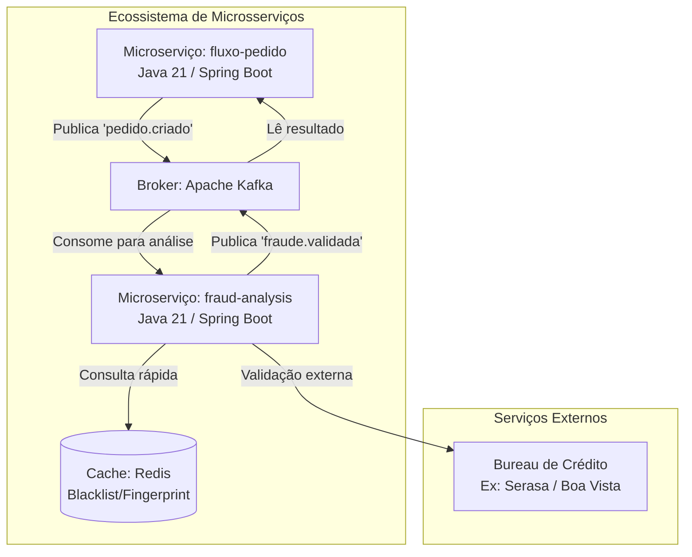
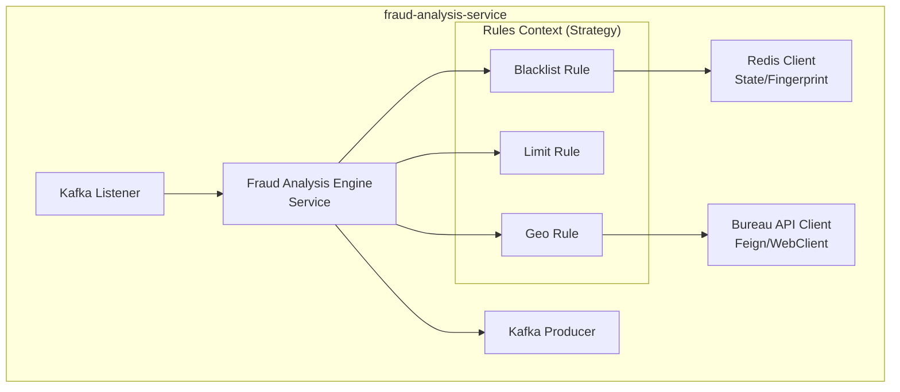

# Fraud Analysis Service 🛡️

Este projeto é um ecossistema de microserviço para análise de fraudes, desenvolvido em **Java 21** com foco em alta performance e observabilidade em tempo real. A infraestrutura é totalmente containerizada, utilizando **Docker** para orquestrar mensageria, cache e monitoramento.

## 🚀 Tecnologias Core & Acessos

* **Spring Boot 4.0.5**: Framework base em **Java 21**, utilizando Virtual Threads para processamento de alto desempenho no processador Ryzen 5.
* **Apache Kafka & UI**: Mensageria para eventos de fraude (Confluent 7.5.0).
    * **URL de Gestão**: [http://localhost:8081](http://localhost:8081) (Kafka-UI).
* **Prometheus**: Banco de dados de séries temporais que realiza o *scrape* das métricas do Spring Boot via Micrometer.
    * **URL**: [http://localhost:9090](http://localhost:9090).
* **Grafana OSS**: Plataforma de visualização onde os dashboards de JVM e Negócio foram configurados.
    * **URL**: [http://localhost:3000](http://localhost:3000) (Login: `admin` / `admin`).
* **Redis 7**: Cache em memória para otimização de consultas recorrentes.
    * **Porta**: `6379`.
* **Infraestrutura**: Ambiente containerizado rodando em **openSUSE Leap 15.6** no notebook **Lenovo IdeaPad 3**.

## 📊 Arquitetura de Observabilidade
O projeto implementa os três pilares da observabilidade:
1. **Métricas**: Dados numéricos agregados (ex: Heap used, Uptime) visualizados no Grafana.
2. **Rastreio (Tracing)**: Fluxo de eventos trafegando entre a API, Redis e o Broker do Kafka.
3. **Logs**: Registros textuais de eventos específicos acessíveis via console dos containers.

## 🛠️ Como Executar

### Passo a Passo
1. Clone o repositório:
   ```bash
   git clone [https://github.com/SEU_USUARIO/fraud-analysis-service.git](https://github.com/SEU_USUARIO/fraud-analysis-service.git)
   cd fraud-analysis-service
2. Preparação da Infraestrutura
Certifique-se de estar na raiz do projeto onde reside o arquivo `docker-compose.yml`. Suba os serviços de suporte (Kafka, Redis, Prometheus e Grafana) com o comando:

```bash
docker-compose up -d
```

## Arquitetura do Microserviço de Fraude

Este projeto utiliza o padrão C4 Model para descrever a infraestrutura.





